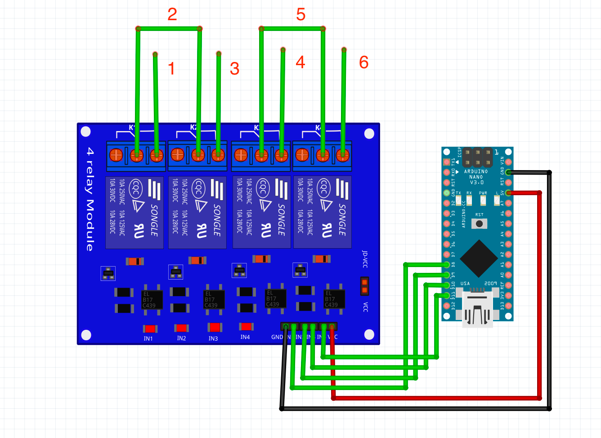
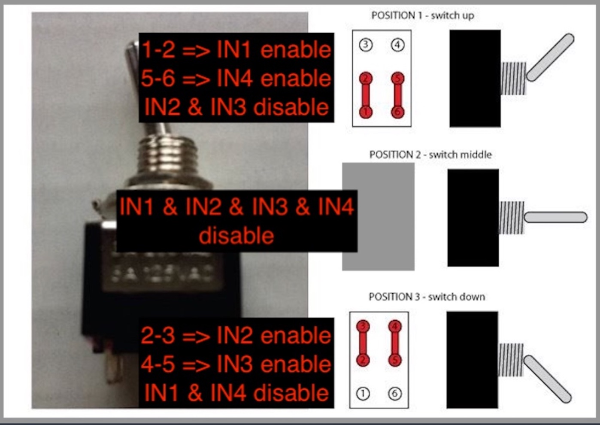
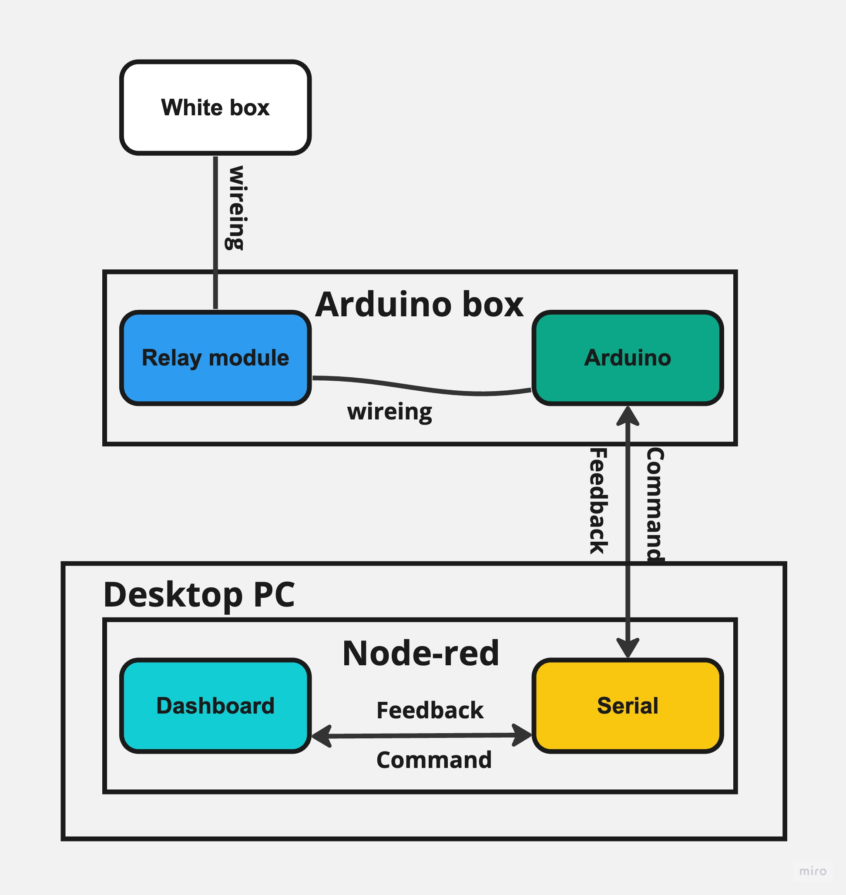

# Clamp15

Simulate remotely clamp15 signal with Arduino and relay module.

## Wiring:

## Flow overview:

## Arduino

An Arduino nano and relay module with 4 relays (see picture above) was used to simulate and replace the guitar 3-step switch.
The project for Arduino is in [PlatformIoClamp15](PlatformIoClamp15).

See https://docs.platformio.org/en/latest/ for more info.

Added Wokwi simulation directly inside the Arduino project.

Install the Wokwi extension and start the simulation directly.

See https://docs.wokwi.com/vscode/getting-started

## Node-red

Node-red was used to simply send the commands that need to be executed to Arduino via a simple interface.

See https://nodered.org/docs/ for installation more info.

## How to

- The Arduino box must be connected to one target UBS port

- ### Node red instructions
  - install node-red and keep it running
  - install palette:
    - node-red-node-serial port
    - node-red-dashboard
  - import the flow.json into node-red
  - configure the serial port and adjust the dashboard interface if needed
